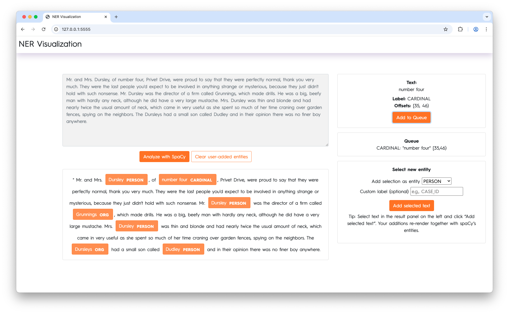

# Flask + spaCy NER Demo

This project is a small **Flask web application** that demonstrates how to use a [spaCy](https://spacy.io) Named Entity Recognition (NER) model in a web frontend.  
It allows you to:

- Enter free text in a form.
- Extract entities with spaCy and render them as **highlighted, clickable spans**.
- Inspect entity details and simulate actions (e.g., “Add to Queue).
- Manually select text and assign it an entity label, which re-renders together with spaCy’s entities.
- Clear all user-added entities and start fresh.

 

---

## Features

- **Backend:** Flask + spaCy  
- **Frontend:** Simple HTML/CSS/JavaScript  
- **Entity highlighting:** Adds `<span>` tags with classes, labels, and data attributes for easy styling and interaction.  
- **Custom entity creation:** Select text in the result panel and assign it a label.  
- **Stateless server:** User-added entities are tracked in the browser and re-sent with each request.  
- **Fallback support:** If `en_core_web_lg` is not installed, the app loads a blank English pipeline with a small `EntityRuler` for demo purposes.  

---

## Installation

### 1. Clone the repo
```bash
git clone https://github.com/your-username/flask-spacy-ner-demo.git
cd flask-spacy-ner-demo
```

### 2. Install Poetry
```bash
pip install poetry
```

### 3. Install dependencies
```bash
poetry install --with dev
````

## Usage
Run the app:
```bash
poetry run python wsgi.pg
```

Open your browser:
```
http://127.0.0.1:5555/
```

## How it Works
1.	Text input → User submits text via the frontend form.
2.	Backend processing → Flask endpoint /analyze passes the text into the spaCy nlp model.
3.	Entity rendering → Entities are converted into custom HTML spans:
```html
<span class="ent" data-label="PERSON" data-start="0" data-end="12" data-text="Barack Obama">
    Barack Obama
</span>
```
4.	Frontend display → The HTML is injected into the result panel. Entities are clickable and show their details in a sidebar.
5.	User annotation → You can select text in the result panel, pick a label, and add it as a new entity.

## Project Structure
```
.
├── app    
├   └── controllers     # Controllers for serving the endpoints.
├   └── dependencies    # Dependencies for the app like the spacy model.
├   └── helpers         # Helpers like HTML rendering of entity spans.
├   └── static          # Static files like css, javascript, etc.
├   └── templates       # Templates for the user interface.
├── README.md           # This file
├── pyproject.toml      # Dependencies (Flask, spaCy)
└── docs/
    └── demo.png        # Screenshot for README
```

## Customization
* Labels: Extend the `<select>` dropdown in the template to support your domain-specific labels.
* Styling: Modify CSS in the CSS file for custom highlighting.
* Persistence: Replace the in-memory “queued actions” with real DB/API calls.

## License
MIT License — feel free to use and adapt for your own projects.